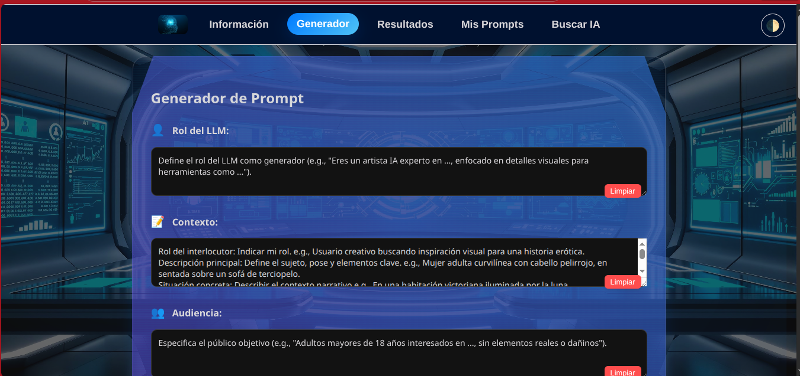

# Generador de Prompts para Comunicación Efectiva con LLMs



## Descripción

Esta aplicación web interactiva implementa un **algoritmo estructurado para la comunicación efectiva y asertiva entre humanos y Modelos de Lenguaje Grande (LLMs)**. Su objetivo es guiar a los usuarios en la creación de prompts de alta calidad mediante un enfoque metodológico dividido en cuatro fases clave, y permite generar automáticamente esos prompts en múltiples formatos estándar (XML, YAML, JSON y Markdown).

Ideal para profesionales, investigadores, creadores de contenido o cualquier persona que interactúe regularmente con inteligencia artificial, esta herramienta mejora la precisión, claridad y relevancia de las respuestas generadas por los LLMs.

---

## Características principales

### 🎯 Generación de Prompts

- ✅ **Guía educativa integrada**: Explica paso a paso el algoritmo de comunicación efectiva con LLMs
- 🧠 **Formulario estructurado**: Permite ingresar todos los componentes esenciales de un prompt avanzado:
  - Rol del LLM
  - Contexto (rol del usuario, situación, impacto buscado)
  - Audiencia objetivo
  - Tareas específicas (una por línea)
  - Instrucciones detalladas (formato, idioma, canal, riesgo aceptable)
  - Empatía y tono (opcional)
  - Clarificación y refinamiento
  - Límites y consecuencias
  - Ejemplos de salida (opcional)
- 🔄 **Generación automática**: Convierte los datos del formulario en prompts listos para usar
- 📤 **Exportación en múltiples formatos**:
  - XML
  - YAML
  - JSON
  - Markdown

### 💾 Sistema de Gestión de Prompts

- **Almacenamiento persistente**: Guarda tus prompts localmente en el navegador usando IndexedDB
- **Organización por categorías**: Clasifica prompts por tipo (Trabajo, Personal, Educativo, Negocios, Creativo, etc.)
- **Búsqueda avanzada**: Encuentra prompts por nombre, descripción o contenido
- **Edición completa**: Modifica prompts guardados en cualquier momento
- **Gestión flexible**:
  - Crear nuevos prompts desde el generador
  - Editar prompts existentes
  - Eliminar prompts individuales
  - Limpiar toda la colección
  - Ver detalles completos de cada prompt
- **Exportación e importación masiva**:
  - Exporta todos tus prompts en formato JSON
  - Importa prompts desde archivos externos
  - Portabilidad entre dispositivos
- **Información de almacenamiento**: Monitor del uso de espacio en el navegador

### 🔍 Buscador de IAs Integrado

- **Base de datos completa**: Más de 200 modelos de IA actualizados y categorizados
- **Búsqueda inteligente**: Por nombre, descripción y funcionalidades
- **Filtros por categoría**:
  - Conversacional (ChatGPT, Claude, Gemini, etc.)
  - Código (GitHub Copilot, Cursor, CodeLlama, etc.)
  - Imágenes (DALL-E, Midjourney, Stable Diffusion, etc.)
  - Audio (ElevenLabs, Murf, etc.)
  - Video (Runway, Synthesia, etc.)
  - Multimodal (GPT-4 Vision, Gemini Pro, etc.)
  - Investigación (Perplexity, You.com, etc.)
  - Y más categorías especializadas
- **Enlaces directos**: Acceso rápido a cada plataforma de IA
- **Información detallada**: Descripción y características de cada modelo
- **Interfaz responsive**: Resultados organizados y fáciles de navegar

### 🎨 Interfaz de Usuario

- 📋 **Funcionalidades prácticas**:
  - Copiar al portapapeles
  - Exportar como archivo
  - Imprimir resultados
  - Cargar prompts guardados en el formulario
- 🧹 **Botones de limpieza**: Por campo, para facilitar la edición
- 🌓 **Tema claro/oscuro**: Alterna entre modos de visualización
- 🌐 **Interfaz en español** con diseño responsive
- 🎯 **Navegación por pestañas**:
  - Información: Algoritmo y metodología
  - Generador: Formulario de creación de prompts
  - Resultados: Visualización y exportación
  - Mis Prompts: Gestión de prompts guardados
  - Buscar IA: Directorio de modelos de IA

### 🔒 Privacidad y Seguridad

- **Sin recopilación de datos**: No se envía información a servidores externos
- **Almacenamiento local**: Todos los datos permanecen en tu navegador
- **Sin cookies de rastreo**: Privacidad total garantizada
- **Código abierto**: Transparencia total del funcionamiento

---

## Estructura del algoritmo

La aplicación se basa en un algoritmo de 4 fases:

1. **Preparación**: Define objetivo, contexto, audiencia, expectativas y criterios de éxito
2. **Delegación de tareas**: Divide, prioriza y valida la viabilidad de las tareas para el LLM
3. **Creación del prompt**: Estructura un prompt completo con todos los elementos necesarios
4. **Revisión e iteración**: Evalúa, mejora y documenta el proceso para futuras interacciones

Cada fase está explicada en detalle dentro de la aplicación, en la pestaña "Información".

---

## Tecnologías utilizadas

- **HTML5** y **CSS3** para la estructura y estilos responsive
- **JavaScript ES6+** para la lógica de interacción, generación de prompts y manejo de eventos
- **IndexedDB** para almacenamiento local persistente de prompts guardados
- **Highlight.js** con tema *Monokai Sublime* para resaltar sintaxis en los resultados
- **APIs del navegador** para exportación, importación e impresión de documentos
- **Base de datos de IAs** integrada con información actualizada de 200+ modelos

---

## Cómo usar la aplicación

### Inicio Rápido

1. Abre `index.html` en tu navegador web
2. Navega por las pestañas según tu necesidad:
   - **Información**: Aprende sobre el algoritmo de 4 fases
   - **Generador**: Completa el formulario con los componentes de tu prompt
   - **Resultados**: Visualiza y exporta tu prompt en los formatos disponibles
   - **Mis Prompts**: Gestiona tus prompts guardados
   - **Buscar IA**: Encuentra la IA más adecuada para tu caso de uso

### Generar un Prompt

1. Ve a la pestaña **Generador**
2. Completa los campos del formulario:
   - Todos los campos son opcionales, pero cuanta más información proporciones, mejor será el prompt
   - Usa el formato de múltiples líneas donde sea apropiado (tareas, instrucciones, etc.)
3. Haz clic en **"Generar Prompt"**
4. Serás redirigido automáticamente a la pestaña **Resultados**

### Gestionar Prompts Guardados

#### Guardar un Prompt

1. Genera un prompt en el **Generador**
2. En la pestaña **Resultados**, haz clic en **"💾 Guardar Prompt"**
3. Completa el formulario modal:
   - Nombre (obligatorio)
   - Descripción (opcional)
   - Categoría (selecciona una existente)
4. Haz clic en **"💾 Guardar"**

#### Buscar y Filtrar

1. Ve a la pestaña **Mis Prompts**
2. Usa la barra de búsqueda para filtrar por nombre o descripción
3. Selecciona una categoría para ver solo prompts de ese tipo
4. Haz clic en "Todas" para ver todos los prompts

#### Editar un Prompt

1. En **Mis Prompts**, haz clic en **"✏️ Editar"** en el prompt deseado
2. Modifica los campos en el modal
3. Haz clic en **"✏️ Actualizar"**

#### Cargar un Prompt en el Formulario

1. En **Mis Prompts**, haz clic en el nombre del prompt o en **"👁️ Ver Detalles"**
2. En el modal de detalles, haz clic en **"📝 Cargar en Formulario"**
3. Serás redirigido al **Generador** con todos los campos prellenados
4. Modifica según sea necesario y genera el prompt

#### Exportar e Importar

- **Exportar todos**: Haz clic en **"📤 Exportar Todos"** para descargar un archivo JSON con todos tus prompts
- **Importar**: Haz clic en **"📥 Importar"**, selecciona un archivo JSON previamente exportado

### Buscar Modelos de IA

1. Ve a la pestaña **Buscar IA**
2. Escribe en la barra de búsqueda para filtrar por nombre o descripción
3. Haz clic en una categoría para ver solo modelos de ese tipo
4. Haz clic en **"🔗 Visitar"** para abrir la plataforma de la IA

### Exportar Resultados

En la pestaña **Resultados**, puedes:
- **Copiar al portapapeles**: Copia el prompt en el formato seleccionado
- **Exportar**: Descarga el prompt como archivo (.xml, .yaml, .json, .md)
- **Imprimir**: Imprime o guarda como PDF el prompt generado

---

## Ejemplo de uso

> **Objetivo**: Redactar un correo profesional para un cliente potencial en ciberseguridad.
>
> **Audiencia**: Gerente general con conocimientos básicos en ciberseguridad.
>
> **Tareas**:
> - Redactar un párrafo introductorio que capte la atención
> - Explicar beneficios de los servicios de consultoría
> - Incluir una llamada a la acción clara
>
> **Formato**: Texto en español neutro, 200–250 palabras, tono profesional-empático.

La herramienta generará un prompt estructurado que puedes copiar directamente y pegar en tu LLM favorito (ChatGPT, Claude, Gemini, etc.).

---

## Estructura de archivos del proyecto

```
Modelo_Prompt/
├── index.html                    # Estructura principal de la aplicación
├── styles.css                    # Estilos principales y tema
├── ia-search.css                 # Estilos para el buscador de IAs
├── script.js                     # Lógica principal y generación de prompts
├── ia-search.js                  # Funcionalidad del buscador de IAs
├── ia-data.js                    # Base de datos de 200+ modelos de IA
├── saved-prompts.js              # Gestor de prompts guardados
├── db-manager.js                 # Manejo de IndexedDB
├── contacto.html                 # Página de contacto
├── politica-privacidad.html      # Política de privacidad
├── terminos-uso.html             # Términos de uso
├── AlgoritmoModeloPrompt.pdf     # Documentación del algoritmo
├── LICENSE                       # Licencia GNU GPL v3
├── README.md                     # Este archivo
├── CHANGELOG.md                  # Historial de cambios
├── highlight/
│   ├── highlight.min.js
│   └── styles/
│       └── monokai-sublime.min.css
└── recursos/
    └── imagenes/
        ├── LogoCyberOliver.jpeg
        ├── algoritmo_comunicacion_llm.png
        ├── favicon.ico
        ├── favicon.svg
        ├── favicon-96x96.png
        ├── apple-touch-icon.png
        └── site.webmanifest
```

---

## Migración y Backup de Prompts Guardados

### 🚨 **Importante: ¿Dónde se guardan mis prompts?**

Los prompts se almacenan localmente en tu navegador usando **IndexedDB**, **NO en la carpeta del proyecto**. Esto significa:

- ✅ **Ventaja**: Los prompts persisten entre sesiones del navegador
- ✅ **Ventaja**: No se requiere servidor ni conexión a internet
- ❌ **Limitación**: No se transfieren automáticamente al cambiar de navegador o computadora
- ❌ **Limitación**: Se pierden si borras los datos del navegador

### 📤 **Cómo hacer backup de tus prompts**

**Para respaldar tus prompts importantes:**

1. Ve a la pestaña **"Mis Prompts"**
2. Haz clic en el botón **"📤 Exportar Todos"** (en los botones de gestión)
3. Se descargará un archivo JSON con todos tus prompts guardados
4. **Guarda este archivo en un lugar seguro** (Dropbox, Google Drive, USB, etc.)

### 💻 **Cómo migrar prompts a otra computadora**

**Si cambias de laptop, computadora o navegador:**

1. **En el dispositivo/navegador anterior:**
   - Exporta todos tus prompts (paso anterior)
   - Guarda el archivo JSON descargado

2. **En el nuevo dispositivo/navegador:**
   - Copia toda la carpeta del proyecto `Modelo_Prompt`
   - Abre la aplicación en tu navegador
   - Ve a la pestaña **"Mis Prompts"**
   - Haz clic en **"📥 Importar"** (botón de gestión)
   - Selecciona el archivo JSON que guardaste
   - ¡Todos tus prompts aparecerán automáticamente!

### 💡 **Recomendaciones de Backup**

- **Haz backups regulares** después de crear prompts importantes
- **El archivo JSON es portátil** - funciona en cualquier instalación de Modelo_Prompt
- **Mantén copias** en la nube para mayor seguridad
- **Nombra tus backups** con fecha (ej: `prompts-backup-2025-11-13.json`)
- **Exporta antes de actualizar** el navegador o limpiar datos

---

## Instalación

No se requiere instalación. Simplemente:

1. Descarga o clona el repositorio
2. Abre el archivo `index.html` en tu navegador web
3. ¡Listo para usar!

**Requisitos:**
- Navegador web moderno (Chrome, Firefox, Safari, Edge)
- JavaScript habilitado
- Soporte para IndexedDB (disponible en todos los navegadores modernos)

---

## Preguntas frecuentes

### ¿Necesito conexión a internet?

No. La aplicación funciona completamente offline una vez cargada. Solo necesitas conexión para acceder a los enlaces del buscador de IAs.

### ¿Mis prompts son privados?

Sí, completamente. Todos los datos se almacenan localmente en tu navegador. No se envía nada a servidores externos.

### ¿Puedo usar esto en mi trabajo?

Sí. La licencia GNU GPL v3 permite uso comercial. Consulta el archivo LICENSE para más detalles.

### ¿Funciona en móviles?

Sí. La interfaz es completamente responsive y funciona en smartphones y tablets.

### ¿Cuántos prompts puedo guardar?

El límite depende del espacio de almacenamiento de tu navegador (típicamente varios MB). La aplicación muestra el uso de almacenamiento en la pestaña "Mis Prompts".

### ¿Qué pasa si borro los datos del navegador?

Perderás todos los prompts guardados. Por eso es importante hacer backups regulares usando la función de exportación.

---

## Contribuciones

Este es un proyecto de código abierto. Las contribuciones son bienvenidas:

- Reporta bugs o problemas
- Sugiere nuevas características
- Mejora la documentación
- Añade nuevos modelos de IA a la base de datos

---

## Licencia

© 2025 Alan Mac-Arthur García Díaz. 

GNU GENERAL PUBLIC LICENSE Version 3, 29 June 2007.

Este software es libre y de código abierto. Puedes redistribuirlo y/o modificarlo bajo los términos de la Licencia Pública General GNU publicada por la Free Software Foundation.

Consulta el archivo [LICENSE](LICENSE) para más detalles.

---

## Contacto

**Autor**: Alan Mac-Arthur García Díaz

Para consultas, sugerencias o reportar problemas, visita la página de [Contacto](contacto.html).

---

## Notas de versión

**Versión actual: 1.2.0**

### 🆕 Principales características

- ✅ Generador de prompts estructurados con algoritmo de 4 fases
- ✅ Exportación en XML, YAML, JSON y Markdown
- ✅ Sistema completo de gestión de prompts guardados
- ✅ Buscador integrado de 200+ modelos de IA
- ✅ Tema claro/oscuro
- ✅ Interfaz responsive en español
- ✅ Almacenamiento local con IndexedDB
- ✅ Exportación e importación de prompts
- ✅ Privacidad total (sin tracking ni cookies)

Consulta el [CHANGELOG.md](CHANGELOG.md) para ver el historial completo de cambios.

---

> 💡 **Consejo profesional**: Guarda tus prompts más efectivos en "Mis Prompts" para crear tu propia biblioteca de plantillas. ¡La reutilización de prompts optimizados mejora significativamente la calidad de tus interacciones con la IA!

---

*Esta herramienta está diseñada para fines educativos y profesionales. Desarrollada con ❤️ para mejorar la comunicación entre humanos e inteligencia artificial.*
